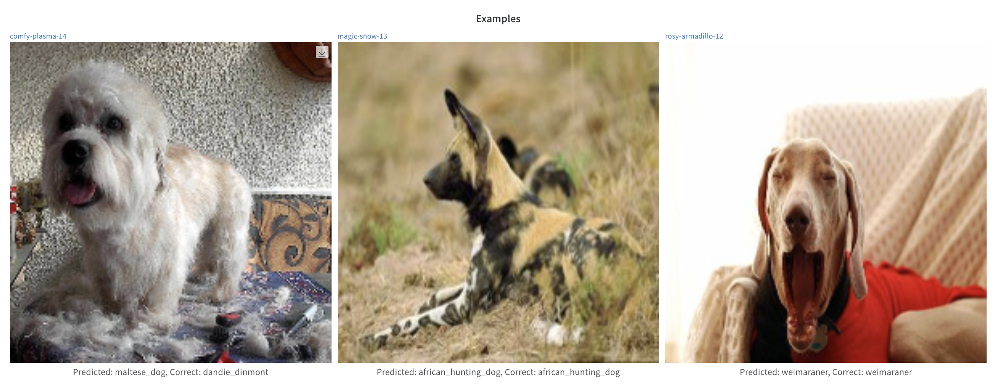
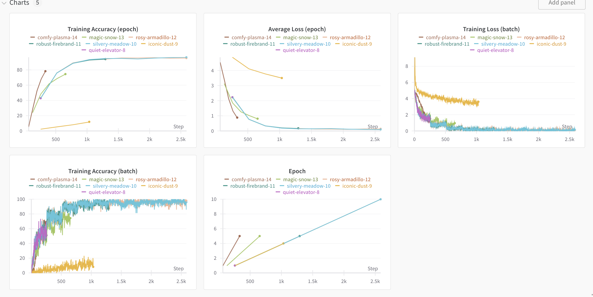
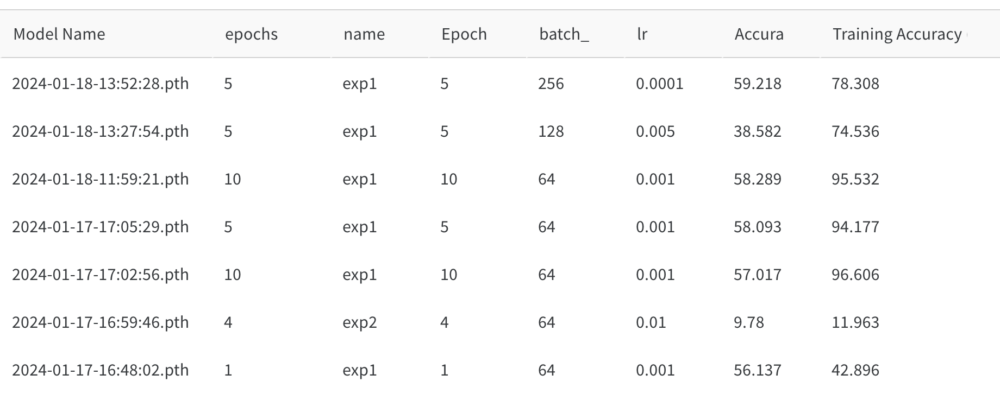

# Exam template for 02476 Machine Learning Operations

This is the report template for the exam. Please only remove the text formatted as with three dashes in front and behind
like:

```--- question 1 fill here ---```

where you instead should add your answers. Any other changes may have unwanted consequences when your report is auto
generated in the end of the course. For questions where you are asked to include images, start by adding the image to
the `figures` subfolder (please only use `.png`, `.jpg` or `.jpeg`) and then add the following code in your answer:

```markdown

```

In addition to this markdown file, we also provide the `report.py` script that provides two utility functions:

Running:

```bash
python report.py html
```

will generate an `.html` page of your report. After deadline for answering this template, we will autoscrape
everything in this `reports` folder and then use this utility to generate an `.html` page that will be your serve
as your final handin.

Running

```bash
python report.py check
```

will check your answers in this template against the constrains listed for each question e.g. is your answer too
short, too long, have you included an image when asked to.

For both functions to work it is important that you do not rename anything. The script have two dependencies that can
be installed with `pip install click markdown`.

## Overall project checklist

The checklist is *exhaustic* which means that it includes everything that you could possible do on the project in
relation the curricilum in this course. Therefore, we do not expect at all that you have checked of all boxes at the
end of the project.

### Week 1

* [ ] Create a git repository
* [ ] Make sure that all team members have write access to the github repository
* [ ] Create a dedicated environment for you project to keep track of your packages
* [ ] Create the initial file structure using cookiecutter
* [ ] Fill out the `make_dataset.py` file such that it downloads whatever data you need and
* [ ] Add a model file and a training script and get that running
* [ ] Remember to fill out the `requirements.txt` file with whatever dependencies that you are using
* [ ] Remember to comply with good coding practices (`pep8`) while doing the project
* [ ] Do a bit of code typing and remember to document essential parts of your code
* [ ] Setup version control for your data or part of your data
* [ ] Construct one or multiple docker files for your code
* [ ] Build the docker files locally and make sure they work as intended
* [ ] Write one or multiple configurations files for your experiments
* [ ] Used Hydra to load the configurations and manage your hyperparameters
* [ ] When you have something that works somewhat, remember at some point to to some profiling and see if
      you can optimize your code
* [ ] Use Weights & Biases to log training progress and other important metrics/artifacts in your code. Additionally,
      consider running a hyperparameter optimization sweep.
* [ ] Use Pytorch-lightning (if applicable) to reduce the amount of boilerplate in your code

### Week 2

* [ ] Write unit tests related to the data part of your code
* [ ] Write unit tests related to model construction and or model training
* [ ] Calculate the coverage.
* [ ] Get some continuous integration running on the github repository
* [ ] Create a data storage in GCP Bucket for you data and preferable link this with your data version control setup
* [ ] Create a trigger workflow for automatically building your docker images
* [ ] Get your model training in GCP using either the Engine or Vertex AI
* [ ] Create a FastAPI application that can do inference using your model
* [ ] If applicable, consider deploying the model locally using torchserve
* [ ] Deploy your model in GCP using either Functions or Run as the backend

### Week 3

* [ ] Check how robust your model is towards data drifting
* [ ] Setup monitoring for the system telemetry of your deployed model
* [ ] Setup monitoring for the performance of your deployed model
* [ ] If applicable, play around with distributed data loading
* [ ] If applicable, play around with distributed model training
* [ ] Play around with quantization, compilation and pruning for you trained models to increase inference speed

### Additional

* [ ] Revisit your initial project description. Did the project turn out as you wanted?
* [ ] Make sure all group members have a understanding about all parts of the project
* [ ] Uploaded all your code to github

## Group information

### Question 1
> **Enter the group number you signed up on <learn.inside.dtu.dk>**
>
> Answer:

--- Group 37 ---

### Question 2
> **Enter the study number for each member in the group**
>
> Example:
>
> *sXXXXXX, sXXXXXX, sXXXXXX*
>
> Answer:

--- s233084, s233085, s232971, s233516, s233107 ---

### Question 3
> **What framework did you choose to work with and did it help you complete the project?**
>
> Answer length: 100-200 words.
>
> Example:
> *We used the third-party framework ... in our project. We used functionality ... and functionality ... from the*
> *package to do ... and ... in our project*.
>
> Answer:

--- As a third-party framework we used a pre-trained model called MobileNet V3 from [Pytorch Image Models](https://github.com/huggingface/pytorch-image-models). MobileNet V3 is a pre-trained image classifier which we could fine-tune with our dataset by re-training the output layer of the model. This model definitely helped us in completing the project as we could achieve a ~65% accuracy on the test set without sacrificing much time in the model definition and data preprocessing. Although this metric is not too high, many of the images in the dataset are hard to classify (e.g. there are multiple objects in the image), and we find that in images where only one dog is present with a generic background, the model tends to correctly classify.  ---

## Coding environment

> In the following section we are interested in learning more about you local development environment.

### Question 4

> **Explain how you managed dependencies in your project? Explain the process a new team member would have to go**
> **through to get an exact copy of your environment.**
>
> Answer length: 100-200 words
>
> Example:
> *We used ... for managing our dependencies. The list of dependencies was auto-generated using ... . To get a*
> *complete copy of our development environment, one would have to run the following commands*
>
> Answer:

--- We used a dedicated conda environment locally to manage the project dependencies. When a new package was added to the project, the team member would also add that to the requirements.txt with either the `pipreqs` command or manually. We have also experimented with adding a workflow that does this task automatically, but we found it rather annoying than useful. We also experienced some issues with the `pipreqs` package, for example it does not add the `google-cloud-storage` dependecy. For a new team member to get a copy of our environement in order to be able to start working on the project, the following commands need to be exectued.
```bash
git clone https://github.com/madiistvan/ml_ops.git
make requirements
```
---

### Question 5

> **We expect that you initialized your project using the cookiecutter template. Explain the overall structure of your**
> **code. Did you fill out every folder or only a subset?**
>
> Answer length: 100-200 words
>
> Example:
> *From the cookiecutter template we have filled out the ... , ... and ... folder. We have removed the ... folder*
> *because we did not use any ... in our project. We have added an ... folder that contains ... for running our*
> *experiments.*
> Answer:

--- As a structure we used the cookiecutter template in our project. The make_dataset.py is responsible for the dataset construction and the predict_model.py and train_model.py were developed along with additional utility files. We have added the a folder named tests, which contains our unit tests related to the data, the endpoints and the model. In addition, 'api' folfer has been created for the source code of the deployed model and we also have added a '.dvc' folder to hold metadata files associated with data versioning, utilizing cloud services. We have removed the notebooks folder because we did not use any Jupyter notebook.

### Question 6

> **Did you implement any rules for code quality and format? Additionally, explain with your own words why these**
> **concepts matters in larger projects.**
>
> Answer length: 50-100 words.
>
> Answer:

--- We established a GitHub workflow designed to do automatic text formatting using the autopep8 package. Initially, the workflow was configured to activate following each push; however, occasional oversights in pulling the formatted code happened, leading to conflicts. Currently we have a new, optimized workflow that allows manual execution, enhancing overall code management and mitigating potential conflicts.---

## Version control

> In the following section we are interested in how version control was used in your project during development to
> corporate and increase the quality of your code.

### Question 7

> **How many tests did you implement and what are they testing in your code?**
>
> Answer length: 50-100 words.
>
> Example:
> *In total we have implemented X tests. Primarily we are testing ... and ... as these the most critical parts of our*
> *application but also ... .*
>
> Answer:

--- In total, we have implemented three tests responsible for assessing the data, endpoints, and the model—considered the most critical components of our application. The tests turned out to be very useful, because with the help of the workflow, we always saw when the tests failed. We could ensure that tests are automatically executed whenever changes are pushed to the repository. This means that we could quickly identify and address problems, preventing flawed code from being merged into the main codebase. ---


### Question 8

> **What is the total code coverage (in percentage) of your code? If you code had an code coverage of 100% (or close**
> **to), would you still trust it to be error free? Explain you reasoning.**
>
> Answer length: 100-200 words.
>
> Example:
> *The total code coverage of code is X%, which includes all our source code. We are far from 100% coverage of our **
> *code and even if we were then...*
>
> Answer:

--- Running the coverage package on the predefined tests, we got result of 86% coverage. The reason for this is that our tests check if the data already exists in the repository, resulting that some parts will not be checked if the data is already present in the folder. We should also note that our tests does not check every python script present in the repository, so we should not expect a completely error free code even if the percentage is 100%. Also if the code coverage was 100% that does not mean all code pathes were checked. Our implemented test, however can detect most of the errors made during changes. ---

### Question 9

> **Did you workflow include using branches and pull requests? If yes, explain how. If not, explain how branches and**
> **pull request can help improve version control.**
>
> Answer length: 100-200 words.
>
> Example:
> *We made use of both branches and PRs in our project. In our group, each member had an branch that they worked on in*
> *addition to the main branch. To merge code we ...*
>
> Answer:

--- We had two protected branches called dev and main (protected branch in our case mean that new changes can not be pushed on the directly). All new features were developed on feauture branches and merged to the dev branch with a pull request. During our project all pull requests required one reviewr to approve the changes and the test workflows to pass. When a new feautere was merged to dev or the dev branch was merged to the main branch various workflows were triggered to publish the new docker images to the cloud and handle their deployement. For the tracking a distribution of issues we used a canban board in the projects section. ---

### Question 10

> **Did you use DVC for managing data in your project? If yes, then how did it improve your project to have version**
> **control of your data. If no, explain a case where it would be beneficial to have version control of your data.**
>
> Answer length: 100-200 words.
>
> Example:
> *We did make use of DVC in the following way: ... . In the end it helped us in ... for controlling ... part of our*
> *pipeline*
>
> Answer:

--- For the first iterations of our pipeline we set up dvc with google drive. This was working fine and than we moved our data to the cloud, to a bucket. We reconfigured a new remote (Google Cloud Storage Bucket) for dvc. Later on both for our tests and model training we opted for directly accessing the data in the bucket so we replaced the dvc pull tasks with direct acces. As our data did not change during the course we did not benefit much from having dvc. However, we understand how it would help with reproducibility in case our dataset changed between experiments. ---

### Question 11

> **Discuss you continues integration setup. What kind of CI are you running (unittesting, linting, etc.)? Do you test**
> **multiple operating systems, python version etc. Do you make use of caching? Feel free to insert a link to one of**
> **your github actions workflow.**
>
> Answer length: 200-300 words.
>
> Example:
> *We have organized our CI into 3 separate files: one for doing ..., one for running ... testing and one for running*
> *... . In particular for our ..., we used ... .An example of a triggered workflow can be seen here: <weblink>*
>
> Answer:

--- We implemented multiple workflows. We had two worklfows that would generate the [requiremnets](https://github.com/madiistvan/ml_ops/actions/runs/7543090217/job/20533319577) and [format](https://github.com/madiistvan/ml_ops/actions/runs/7555351828/job/20570149236) the pushed code however we found it distrubing and changed them from automatic to manual trigger. We chose this approach to still have options for automatic code generation and formatting but would not have to face the issues of automatic commits to the branches (that would also not be possible on our protected branches (dev, main) Secondly we had a workflow that runs our [tests](https://github.com/madiistvan/ml_ops/actions/runs/7558614715/job/20580548192). We found the testing workflow especially usefull because it let us detect any mallfunctions before building new containers and training new model without having to spend any compute credits on jobs that were destined to fail. Passing all tests in the previously described workflow was one of the requirements with an approval from a reviewer to mrege new changes to a protected branch Furthermore we have a [manually triggerable](https://github.com/madiistvan/ml_ops/actions/runs/7556429310/job/20573415140) workflow that starts a training job with Vertex AI. (the training job takes the parameters of training from the branch it is selected to run on) This workflow also could be configured for different environments (such as cpu, gpu, because we did not get increased quota for gpus that part is unimplemented).
During running our tests we used pip cache when downloading dependencies. ---

## Running code and tracking experiments

> In the following section we are interested in learning more about the experimental setup for running your code and
> especially the reproducibility of your experiments.

### Question 12

> **How did you configure experiments? Did you make use of config files? Explain with coding examples of how you would**
> **run a experiment.**
>
> Answer length: 50-100 words.
>
> Example:
> *We used a simple argparser, that worked in the following way: python my_script.py --lr 1e-3 --batch_size 25*
>
> Answer:

--- We saved the trained model with the network layout and the used hydra config files to a separate folder in a bucket dedicated for each specific expirememnt. Triggering and experiment can be done by merging to dev or main branches and triggering the manual workflow to start training. After the training job ended the required data to reproduce is saved. The experiments and created data can be seen in our wandb project. Also it is possible to trigger an experiment from the terminal the same data is saved in the same manner as previously described.  ---

### Question 13

> **Reproducibility of experiments are important. Related to the last question, how did you secure that no information**
> **is lost when running experiments and that your experiments are reproducible?**
>
> Answer length: 100-200 words.
>
> Example:
> *We made use of config files. Whenever an experiment is run the following happens: ... . To reproduce an experiment*
> *one would have to do ...*
>
> Answer:

--- We carefully created our experiment setup to optimize for reproduciblity we used config files for all of our new experiments. To reproduce an experiment one would need to see the experiments page in wandb locate the model and weights with the config file from our model bucket. Load them and either merge them to one fo the protected branches and trigger the manual workflow or run training locally in the teminal. By saving the layout of the network and the hyperparameters we have everything to reproduce previously done experiments and because we saved our models we can even compare our findings. ---

### Question 14

> **Upload 1 to 3 screenshots that show the experiments that you have done in W&B (or another experiment tracking**
> **service of your choice). This may include loss graphs, logged images, hyperparameter sweeps etc. You can take**
> **inspiration from [this figure](figures/wandb.png). Explain what metrics you are tracking and why they are**
> **important.**
>
> Answer length: 200-300 words + 1 to 3 screenshots.
>
> Example:
> *As seen in the first image when have tracked ... and ... which both inform us about ... in our experiments.*
> *As seen in the second image we are also tracking ... and ...*
>
> Answer:

--- We used W&B to track our experiments. We also passed our config file to W&B to be able to track our hyperparameters (batch size, learning rate, epochs). Besides that, the config file holds the names of our data buckets, so we are able to see the location of the dataset and the trained models. During training, we track the value of the loss and accuracy on the current batch. After each epoch, we also calculate the average of these values. After the training is finished, we calculate the accuracy on our validation dataset (although we probably should do this at least after each epoch to keep track of overfitting). Some predictions can be seen after the run as we uploaded some images with showing its true label and prediced label from the training set.  We can also compare our runs by looking at the created graphs, although the x axis is not unified: trainings with different batch sizes are not aligned because the x axis shows the number of batches.  With our current setup, the best way to compare trained models is to look at the runs tab and check the logged information.  Here we can see every meaningful information such as validation accuracy, learning rate, epochs and based on this we can evaluate the success of the run. ---

### Question 15

> **Docker is an important tool for creating containerized applications. Explain how you used docker in your**
> **experiments? Include how you would run your docker images and include a link to one of your docker files.**
>
> Answer length: 100-200 words.
>
> Example:
> *For our project we developed several images: one for training, inference and deployment. For example to run the*
> *training docker image: `docker run trainer:latest lr=1e-3 batch_size=64`. Link to docker file: <weblink>*
>
> Answer:

--- We created docker files for the functionality we wanted to deploy to the cloud. In our case that means we had two docker files one for running training a new model and one for deploying rained models to the cloud. We did not run images manually as theye were built with Cloud Build and stored in Container Registry, and the training job was ran with Vertex Ai. (the commands to run can be found in the workflow) During this project we wanted everything to be automatized as possible and to use Google Cloud Functionality as much as we can [link to docker file in our repository](https://github.com/madiistvan/ml_ops/blob/report/dockerfiles/train_model.dockerfile).In case someone wants they can also create the docker images and run the containers locally. In the case of training, the run command would look like: 
```
docker run --name exp1 train:latest --num_epochs 5 --batch_size 64 --lr 0.005 --model_name model1
``` 
---

### Question 16

> **When running into bugs while trying to run your experiments, how did you perform debugging? Additionally, did you**
> **try to profile your code or do you think it is already perfect?**
>
> Answer length: 100-200 words.
>
> Example:
> *Debugging method was dependent on group member. Some just used ... and others used ... . We did a single profiling*
> *run of our main code at some point that showed ...*
>
> Answer:

--- For debugging our python code we took advantage of break points and print statements to find what we messed up. Also with the help of our automatized test we were ableto detect error and somewhat easily determine which section of our code contains the bugs . We had some troubles with worklows not working as expected. To solve these issues when it was feasible we tried to excecute the command locally to find out what goes wrong. When the commands worked fine locally or could not be run locally we wrote most thing to the output to see the cause of our issues. Most often it was sufficient to do the local testing, however on some occasions like workflow authentication we ahd  to trigger workflows quite often. ---

## Working in the cloud

> In the following section we would like to know more about your experience when developing in the cloud.

### Question 17

> **List all the GCP services that you made use of in your project and shortly explain what each service does?**
>
> Answer length: 50-200 words.
>
> Example:
> *We used the following two services: Engine and Bucket. Engine is used for... and Bucket is used for...*
>
> Answer:

--- We used the following services: Vertex AI, Cloud Build, Cloud Run, Bucket, Container registry, IAM 
- Vertex AI, for running our experiments
- Cloud Build, for building our containers
- Bucket, for storing the data, and the details and results of our experiments.
- Container registry, for storing the built docker images.
- IAM, Resource acces managment for our workflows.
- Cloud Run, for deploying our model to the cloud. ---

### Question 18

> **The backbone of GCP is the Compute engine. Explained how you made use of this service and what type of VMs**
> **you used?**
>
> Answer length: 100-200 words.
>
> Example:
> *We used the compute engine to run our ... . We used instances with the following hardware: ... and we started the*
> *using a custom container: ...*
>
> Answer:

--- We did not use Compute engine. We did our training using Vertex Ai, therefore this question is not applicable for our project.
We did not use Compute engine. We did our training using Vertex Ai, therefore this question is not applicable for our project.
We did not use Compute engine. We did our training using Vertex Ai, therefore this question is not applicable for our project.   We did not use Compute engine. We did our training using Vertex Ai, therefore this question is not applicable for our project.
(Want to pass all tests with report.py 's check :) ) ---

### Question 19

> **Insert 1-2 images of your GCP bucket, such that we can see what data you have stored in it.**
> **You can take inspiration from [this figure](figures/bucket.png).**
>
> Answer:

---  ---

### Question 20

> **Upload one image of your GCP container registry, such that we can see the different images that you have stored.**
> **You can take inspiration from [this figure](figures/registry.png).**
>
> Answer:

---  ---


### Question 21

> **Upload one image of your GCP cloud build history, so we can see the history of the images that have been build in**
> **your project. You can take inspiration from [this figure](figures/build.png).**
>
> Answer:

---  ---

### Question 22

> **Did you manage to deploy your model, either in locally or cloud? If not, describe why. If yes, describe how and**
> **preferably how you invoke your deployed service?**
>
> Answer length: 100-200 words.
>
> Example:
> *For deployment we wrapped our model into application using ... . We first tried locally serving the model, which*
> *worked. Afterwards we deployed it in the cloud, using ... . To invoke the service an user would call*
> *`curl -X POST -F "file=@file.json"<weburl>`*
>
> Answer:

--- First, we developed a separate python file for predicting based on a pretrained model. Secondly, with FastApi we created a web api that takes in one or multiple images and than predicts the dog breed for each image passed as an input. We created a docker file that when built runs the aforementioned web api. This docker docker image is built with the help of Cloud Build whenever new changes were added to dev or main branches and than with CLoud Run it is deployed and can be accessed with the following command:. ```curl -X POST https://dog-breed-identification-api-k3daan6qya-ew.a.run.app/predict -F "PATH_TO_YOUR_IMAGE"```

Example response of the web api: ```[{"filename":"0a01f3b0c6d250c08785716c562e2d4d.jpg","probability":0.6926616430282593,"breed_idx":81,"breed":"norwich_terrier","status":"success","message":"Cute puppy detected"}]``` ---

### Question 23

> **Did you manage to implement monitoring of your deployed model? If yes, explain how it works. If not, explain how**
> **monitoring would help the longevity of your application.**
>
> Answer length: 100-200 words.
>
> Example:
> *We did not manage to implement monitoring. We would like to have monitoring implemented such that over time we could*
> *measure ... and ... that would inform us about this ... behaviour of our application.*
>
> Answer:

--- We did not manage to implement monitoring of our deployed model, but monitoring certain features could help us detecting problematic trends. As we are using images as inputs we could extract features from the training data and data sent to our predict endpoint and see if our model becomes obsolate for some reason (e.g. data drifting). Furthermore, monitoring what kind of classes our model outputs (or what kind of dogs are given as input to our model) would let us know better what users use our model for. Additionally, we could measure how fast our model does the forward pass, to see if there are major bottlenecks in our implementation.---

### Question 24

> **How many credits did you end up using during the project and what service was most expensive?**
>
> Answer length: 25-100 words.
>
> Example:
> *Group member 1 used ..., Group member 2 used ..., in total ... credits was spend during development. The service*
> *costing the most was ... due to ...*
>
> Answer:

--- We used one account that shared the project with the rest of the group. Most of the credits were spent on cloud storage as we store all of our docker images that were evere built and one's size is around 2GB. In total we spent aproximatelly ~14$ ---

## Overall discussion of project

> In the following section we would like you to think about the general structure of your project.

### Question 25

> **Include a figure that describes the overall architecture of your system and what services that you make use of.**
> **You can take inspiration from [this figure](figures/overview.png). Additionally in your own words, explain the**
> **overall steps in figure.**
>
> Answer length: 200-400 words
>
> Example:
>
> *The starting point of the diagram is our local setup, where we integrated ... and ... and ... into our code.*
> *Whenever we commit code and puch to github, it auto triggers ... and ... . From there the diagram shows ...*
>
> Answer:

---  Our set upp stars from each of the group members setup where we had our onw separate conda environment from the requirements.txt files. Next we have our github repository where we have two protected branches (dev and main). When changes are added to these branche various workflows are triggered and google cloud triggers are run. The workflows: testing, runs all of our tests, optionally formatting and requirement generation. Optional training job starting in Vertex ai. Google cloud triggers are actiated to build our docker files (prediction api image and training image). The images are built with CLoud Build and stored in the Container registry (currently we store all built images, however, due to the very frequent changes megrged to dev and main a significant amount of our credits are spent on storing the previously built images). The built predict api image is than deployed to Cloud run. That can be accessed through the web to test out our model and predic dog breeds. The training image can be triggered manually with the previously mentioned workflow. The experiment's configuration is stored in a separate bucket with the model's layout and the trained weights. Also, the all of the previous components fetch the data from a sparate bucket for data storing either with a dvc pull command or directly accessing it. ---

### Question 26

> **Discuss the overall struggles of the project. Where did you spend most time and what did you do to overcome these**
> **challenges?**
>
> Answer length: 200-400 words.
>
> Example:
> *The biggest challenges in the project was using ... tool to do ... . The reason for this was ...*
>
> Answer:

--- We spent a great deal of time trying to figure out how we can connect / integrate seperate services or tools. These included accessing the buckets in the Google Storage service from our containers and workflows; figuring out how we can authenticate Weights and Biases inside a container so when we do a training with Vertex AI we can see the logs on the Web UI (this was especially painful and our current solution might not be the best); authenticating to Google services from the GitHub workflows; giving access to service workers. We also spenta lot of time figuring out the automated pipelines which included writing the workflows and docker files. Some other areas where we faced challenges were setting up Hydra properly (the way it initializes was not a hundred percent clear and this caused some issues) and we also had some issues setting up dvc in a GitHub workflow with google cloud storage. Another part that caused some troubles were understanding cloudbuilds and how they relate to Goole Cloud triggers and how to set up these to work properly. Overall, we would say that the most problematic part was authentication, giving permissions in the right places and figuring out how we can use secrets in some places. ---

### Question 27

> **State the individual contributions of each team member. This is required information from DTU, because we need to**
> **make sure all members contributed actively to the project**
>
> Answer length: 50-200 words.
>
> Example:
> *Student sXXXXXX was in charge of developing of setting up the initial cookie cutter project and developing of the*
> *docker containers for training our applications.*
> *Student sXXXXXX was in charge of training our models in the cloud and deploying them afterwards.*
> *All members contributed to code by...*
>
> Answer:

--- Student s232971: Set up our data stroage in the cloud and dvc. Training model in the cloud with vertex ai, workflow for training, parameterizing training, Unit test for data and model covarage + workflow. Auto fromatting workflow. Direct data loading from storage bucket. Managed the git repo. Most of the report. Figuring out WandB auth with Vertex AI with s233084. 

Student 233084: Code typing. Adding arguments to prediction file. Deploying the model with a FastAPI endpoint and setting up trigger and cloudbuilds for continous deployment. Setting up and using Hydra. Creating the repository template with cookicutter. Creating dockerfiles for training and deploying model. Setting up Weights and Biases and using it for basic monitoring. Figuring out WandB auth with Vertex AI with s232971.

Student s233085: Make dataset, train model and predict model. Writing at keeping track of trained models in data buckets. Monitoring system telemetry of the deployed api + SLOs. Continous integrations by github workflow.---